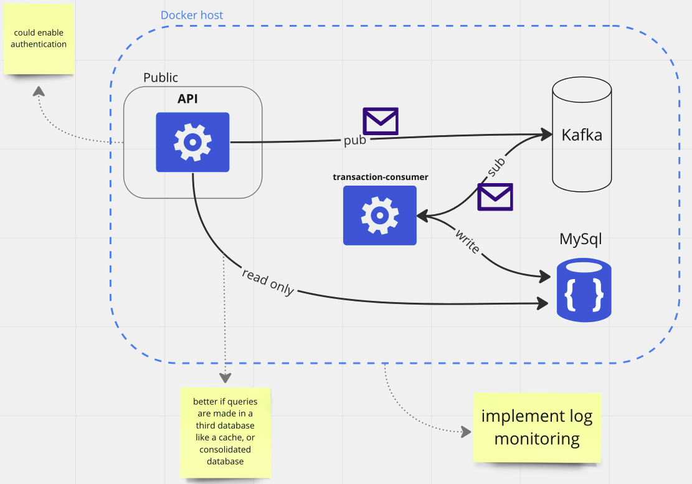

## Cash flow architecture exemple

This project implements a cash flow used as an example of software architecture.

### Actual diagram of projects implementation
-  
### Patterns

+ CQRS
+ Microservices
+ Asynchronous Messaging
+ Web API
+ Unit tests (TODO)  

### Technologies

+ ExpressJS for http server
+ SwaggerJS for API documentation
+ Kafka for message communication
+ Docker for run services
+ MySql for database 
+ Jest for unit tests (TODO)

### How to run
You need to have docker installed, than run above command:
```shell
docker-compose up --build
```
The API project will run at port 3000. Access [localhost:3000/api-docs]() to test endpoints.
  

### Future:
+ Implemente unit tests with Jest
+ Integrate the database in a non-relational database to consolidate datas like the daily, monthly and yearly balance for example.
+ Implement a rich logging tool like [pino](https://github.com/diegotroitino/nodejs-reference-architecture/tree/main/logging/pino-sample)
+ Identify the user from a JWT
+ 